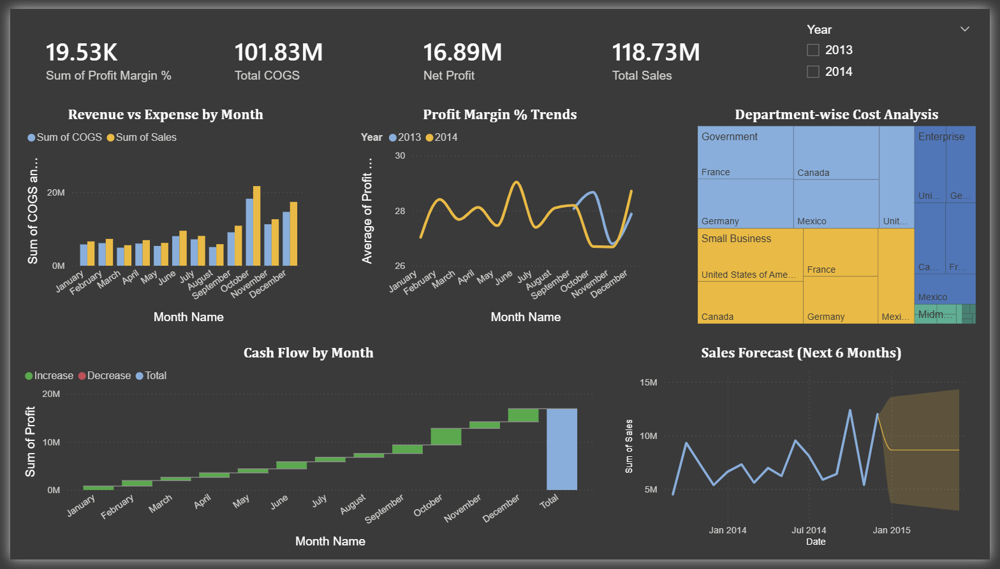
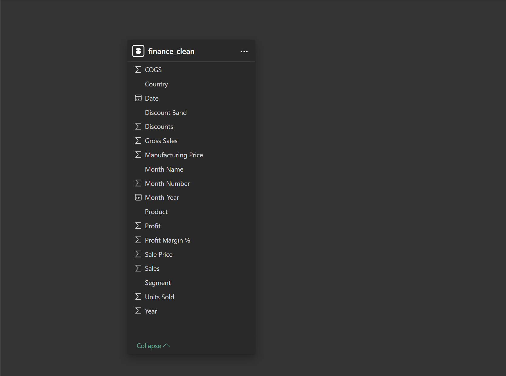

# 📊 Finance Analytics Dashboard | Power BI

> **End-to-End Finance Analytics Solution integrating Data Cleaning, Modeling, KPI Engineering, and Executive Visualization.**




---

## 🔎 Project Overview

An interactive **Finance Analytics Dashboard** developed in Power BI to monitor organizational financial performance, profitability trends, operational expenses, and cash flow behavior across 2013–2014.

The dashboard enables business stakeholders to track key financial KPIs and supports **data-driven strategic decision making** at the executive level.

---

## 👥 Primary Users

| User | Purpose |
|---|---|
| **CFO / Leadership Team** | Executive financial health monitoring |
| **Finance Managers** | Budget tracking and variance analysis |
| **Operations Heads** | Department-wise cost control and optimization |

---

## 🎯 Business Problem

Organizations often struggle to obtain a consolidated view of financial performance across departments, resulting in delayed decision making and inefficient cost control.

This dashboard addresses:
- Lack of centralized financial visibility
- Difficulty tracking revenue vs expenses month-over-month
- Poor monitoring of profit margins across segments
- Absence of forward-looking forecasting insights

---

## 🧠 Business Objectives

- Analyze Revenue vs Expenses trends across all months
- Monitor Profitability and Profit Margin % over time
- Track Department-wise and Segment-wise cost allocation
- Evaluate Cash Flow performance and cumulative profit
- Provide 6-month Financial Forecasting insights

---

## 🗂 Dataset Information

| Field | Details |
|---|---|
| Source | Microsoft Financial Sample Dataset |
| Records | 700 rows × 16 columns |
| Period | September 2013 – December 2014 |
| Segments | Government, Small Business, Enterprise, Midmarket, Channel Partners |
| Countries | USA, Canada, France, Germany, Mexico |

---

## 🐍 Python Data Engineering Steps

- Loaded raw Excel dataset using `pandas` for programmatic inspection
- Identified and handled 53 missing categorical values in `Discount Band`
- Stripped leading/trailing whitespace from all column names
- Engineered `Profit Margin %` feature: `(Profit / Sales) * 100`
- Generated `Month-Year` column for clean time-axis display in Power BI
- Validated data types and corrected date formatting
- Exported fully processed CSV for BI consumption

```python
# Feature Engineering
df.columns = df.columns.str.strip()
df['Discount Band'] = df['Discount Band'].fillna('None')
df['Profit Margin %'] = (df['Profit'] / df['Sales'] * 100).round(2)
df['Month-Year'] = pd.to_datetime(df['Date']).dt.to_period('M').astype(str)
df.to_csv("finance_clean.csv", index=False)
```

---

## ⚙️ Data Modeling

Star schema model implemented with relationships between:
- Date dimension
- Sales/Revenue fact table
- Segment dimension
- Country dimension

Designed star schema to minimize filter propagation complexity and improve report refresh performance.

### Data Model



---

## 📈 Key KPIs Designed

- **Total Sales** — Aggregate revenue across all segments and countries
- **Net Profit** — Total revenue minus total cost of goods sold
- **Profit Margin %** — Net profit as a percentage of total sales
- **Revenue Growth %** — Month-over-month sales growth rate
- **Expense Ratio** — COGS as a proportion of total revenue
- **Department Cost Contribution %** — Segment-wise share of total operational cost

> *All KPI values are visible on the live dashboard. README documents the logic and definitions.*

---

## 🧮 DAX Measures

```dax
Total Sales = SUM(finance_clean[Sales])

Total COGS = SUM(finance_clean[COGS])

Net Profit = SUM(finance_clean[Profit])

Profit Margin % (M) = DIVIDE([Net Profit], [Total Sales], 0)

Revenue Growth % =
DIVIDE(
    [Total Sales] - CALCULATE([Total Sales], PREVIOUSMONTH(finance_clean[Date])),
    CALCULATE([Total Sales], PREVIOUSMONTH(finance_clean[Date])),
    0
)

Expense Ratio = DIVIDE([Total COGS], [Total Sales], 0)

Dept Cost Contribution % =
DIVIDE(
    SUM(finance_clean[COGS]),
    CALCULATE(SUM(finance_clean[COGS]), ALL(finance_clean[Segment])),
    0
)
```

---

## 📊 Dashboard Pages

| Page | Description |
|---|---|
| **Executive Summary** | Financial performance overview, KPI cards, year slicer |
| **Profitability Analysis** | Profit Margin % trends by month and year |
| **Cost Optimization** | Department-wise and segment-wise COGS breakdown |
| **Cash Flow Monitoring** | Monthly cash flow waterfall chart |
| **Forecasting Analysis** | 6-month forward revenue projection with 95% confidence |

---

## 🏗 Project Architecture

```
Raw Financial Data (Excel)
        ↓
Python Data Engineering (pandas)
        ↓
Cleaned CSV Export
        ↓
Power BI Data Modeling (Star Schema)
        ↓
DAX KPI & Ratio Calculations
        ↓
Interactive Executive Dashboard
```

Designed star schema to minimize filter propagation complexity and improve report refresh performance.

---

## 💡 Key Business Insights

- **Q4 Seasonality**: Sales peak significantly in October–December across both years
- **Government Dominates Costs**: Largest segment by COGS — prime candidate for cost optimization
- **Healthy Margins**: 27–29% profit margin maintained consistently — business is operationally sound
- **No Loss Months**: Every single month contributed positively to cumulative profit
- **November Dip**: Profit margin drops in November both years — warrants seasonal strategy review
- **Forecast**: Sales projected to stabilize at 8–10M/month for first half of 2015

---

## 📊 Analytical Decisions Enabled

- Budget reallocation across high-cost vs high-profit segments
- Seasonal expense planning around November margin dips
- Profitability monitoring and reporting by leadership
- Long-term revenue strategy evaluation using forecast trends
- Vendor contract review for Government segment cost control

---

## 📌 Management Recommendations

| Problem | Insight | Recommended Decision |
|---|---|---|
| High operational cost in Government segment | Government COGS is disproportionately large | Review vendor contracts and procurement processes |
| November margin dip repeats yearly | Consistent seasonal pattern in 2013 and 2014 | Pre-plan cost controls and promotions for November |
| Midmarket segment underrepresented | Low revenue contribution vs cost allocated | Evaluate growth potential or reallocate resources |
| Forecast shows sales plateau | Growth rate slowing into 2015 | Diversify into new markets before Q2 2015 |

---

## 🔄 Future Enhancements

- Automated data refresh using scheduled pipelines
- Direct database connectivity instead of flat CSV files
- Cloud-hosted dashboard deployment for real-time access
- Real-time financial monitoring integration via live data streams
- Role-level security (RLS) for department-specific access control

---

## 🛠 Tools & Technologies

- **Python (pandas)** — Data engineering, null handling, feature creation
- **Power BI Desktop** — Dashboard design, DAX measures, forecasting
- **Power Query** — Data transformation and type management
- **DAX** — Custom KPI, ratio, and growth calculations
- **Star Schema Modeling** — Optimized relational data model
- **Git & GitHub** — Version control and portfolio publishing

---

## 🚀 Business Value

This dashboard enables leadership teams to:
- Monitor organizational financial health in real time
- Identify cost optimization opportunities by segment
- Improve budgeting and resource allocation decisions
- Support strategic financial planning with forward-looking forecasts

---

## 📂 Project Structure

```
finance-analytics-dashboard/
│
├── Financial Sample.xlsx       # Raw dataset (Microsoft Financial Sample)
├── finance_clean.csv           # Cleaned dataset (Python output)
├── Project 1.py                # Python data engineering script
├── Finance_Dashboard.pbix      # Power BI Dashboard file
├── dashboard_preview.png       # Dashboard screenshot
├── data_model.png              # Power BI Model View screenshot
└── README.md                   # Project documentation
```

---

## 👤 Author

**Syed Kafeel Ahamed**

Finance professional with 6+ years of accounting experience transitioning into Data Analytics, leveraging domain expertise to build business-driven analytical solutions.

🔗 [LinkedIn](https://www.linkedin.com/in/syed-kafeel-ahamed-ab465036b) | [GitHub](https://github.com/ahamedkafeel22)
